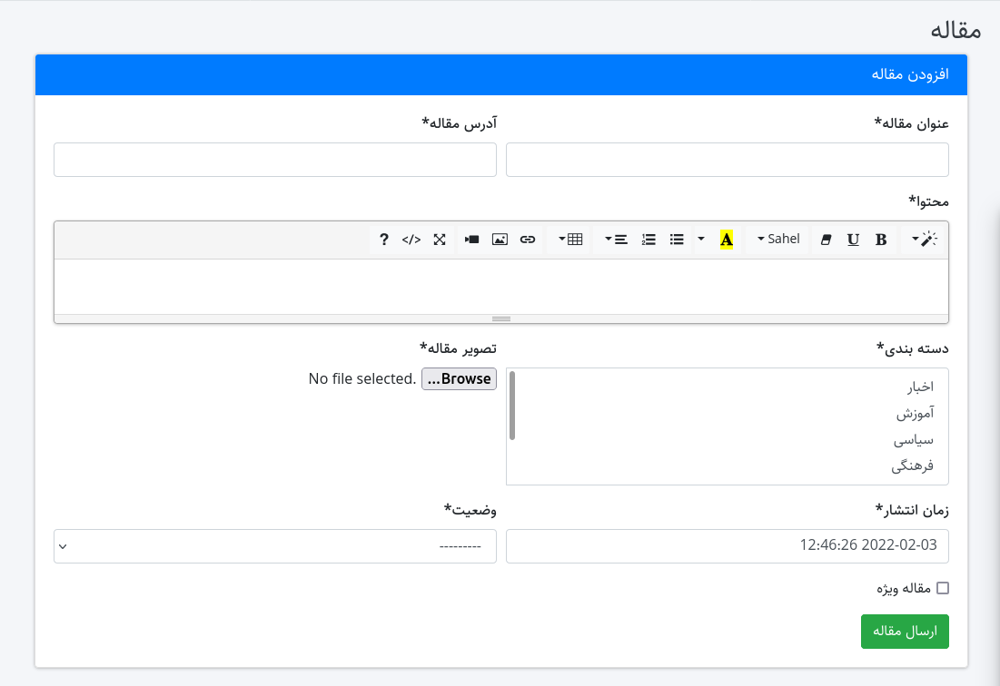
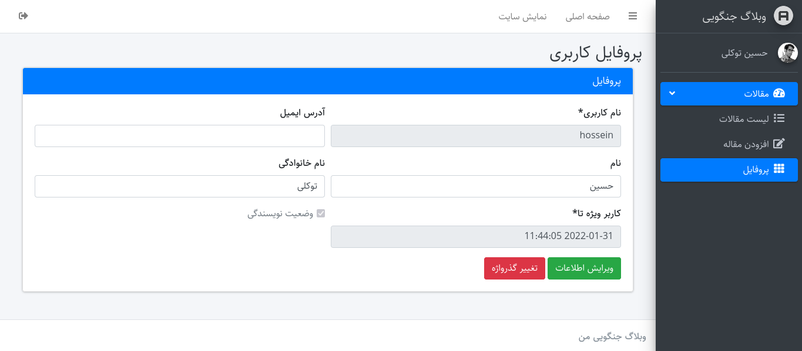
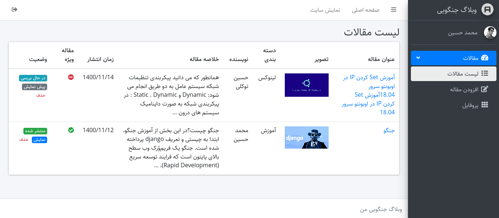

# django-blog

<table>
    <tr>
        <td></td>
        <td></td>
    </tr>
    <tr>
        <td></td>
        <td></td>
    </tr>
</table>

## install

<p>
Enter your email and secret key in <b>.env</b> file
</p>

```
pip install -r requirements
python manage.py makemigrations
python manage.py migrate
```

### create superuser

```
python manage.py createsuperuser
```

<p>After all these steps , you can start testing and developing this project.</p>